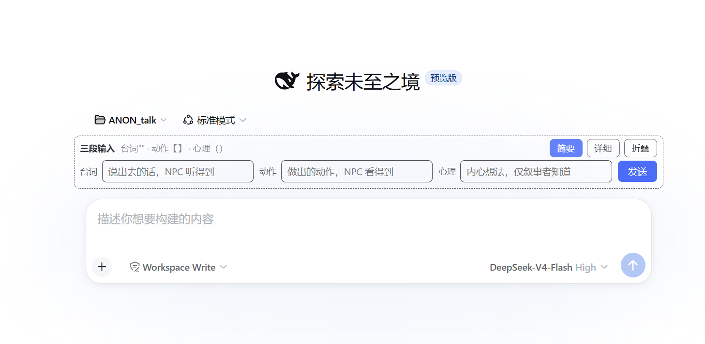
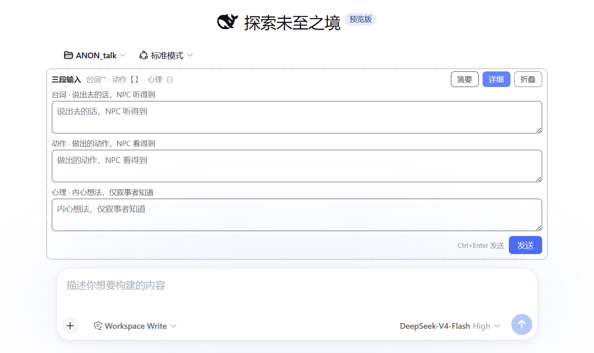
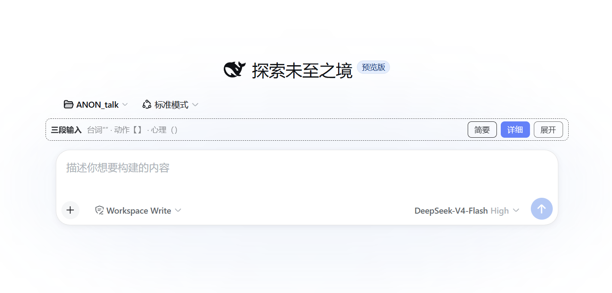

# TriComposer · 三段输入（dsh-rp-composer）

[English README](README_EN.md)

一个面向 DeepSeek Harness（DSH）web 端的角色扮演输入增强插件。

在 RP 对话中，玩家的一条输入往往混合**台词、动作、心理**三种成分。纯文本无标记时，AI 容易混淆识别——让 NPC"听见"了心理活动、把动作当成对话、或替玩家补全并未发生的言行。TriComposer 把输入框拆成三个填空框，用户只需分别填写，插件自动按约定模板组装发送，从源头消除成分混淆。

## 功能

- **三段填空**：台词 / 动作 / 心理三个独立输入框，任意组合，留空自动省略
- **模板组装**：动作→`【】`，台词→`“”`，心理→`（）`，与 RP 输入解析协议（如 Gent 模式预设）直接兼容
- **双视图**：简要（横向单行，快进短句）/ 详细（纵向多行，长段落可视范围更大，支持 Ctrl+Enter 发送）
- **折叠收纳**：收起为一条标题栏，界面状态（视图/折叠）持久化在浏览器
- **零侵入**：挂载于官方 `conversation.input.dock` 槽位，不替换默认输入框，不影响 Agent RP、便携酒馆等其他插件
- **标准管线**：组装结果走"写入草稿 + 提交"的标准发送路径，会话记录、撤回、重发行为与手敲完全一致

## 演示

| 简要（横向） | 详细（纵向） | 折叠 |
|---|---|---|
|  |  |  |

## 安装

```bash
# 本地目录安装（link 模式，改代码即时生效）
dsh plugin --profile web add /path/to/dsh-rp-composer

# 或从 GitHub 安装
dsh plugin --profile web add github:wuzhigouno-collab/dsh-rp-composer
```

安装后重启 web 端（`dsh web`），进入任一会话即可在输入框上方看到面板。

## 技术要点

- 纯客户端插件：Node 半为空壳，浏览器半经 `dsh.client` 声明加载
- UI 挂载：cordis `slots` 服务，`conversation.input.dock`（list 型、session 作用域）
- 发送：`props.inputActions.setDraft(text)` + `inputActions.submit()`（InputZone 标准套件）
- 模板：DSH 双面插件结构（`dsh.plugin.json` + `cordis.patch.yml` bundle 声明 + ModuleLoader 格式 client bundle），参考 dsh-portable-tavern

## 许可

MIT（见 LICENSE）
